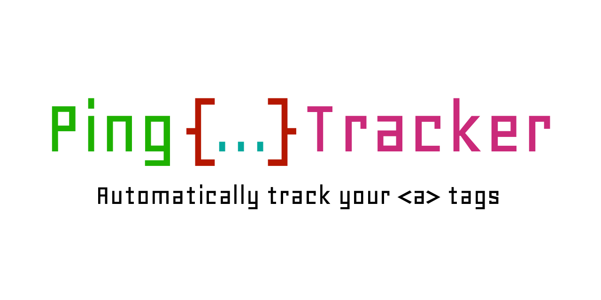

# Ping Tracker




<a href="https://github.com/matronator"></a>
<a href="https://github.com/sponsors/matronator/"></a>

Ping Tracker is a tiny library that adds `ping` attribute to all `<a>` tags on the site with customizable list of URLs.

## Features

-   🏓 Add `ping` attribute to all `<a>` tags automatically
-   👀 Watch for changes using `MutationObserver` to modify newly added links
-   📝 Customize the content of the `ping` tag (list of URLs)
-   ⚡️ Tiny library
-   🔥 Written in TypeScript

## Installation

```
npm i ping-tracker
```

## Usage

```js
import { PingTracker } from "ping-tracker";

const pt = new PingTracker("https://analytics.example.com");

// Or with options

const pt = new PingTracker("https://analytics.example.com", {
    hrefToQuery: false,
    onlyExternal: false,
    watchDOM: true,
    elementsToWatch: document.body,
});
```
